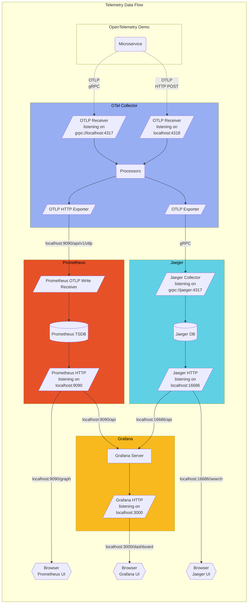

# OpenTelemetry Test

Follow these links for the current state of
[metric](/docs/demo/telemetry-features/metric-coverage/) and
[trace](/docs/demo/telemetry-features/trace-coverage/) instrumentation of the
demo applications.

The collector is configured in
[otelcol-config.yml](https://github.com/open-telemetry/opentelemetry-demo/blob/main/src/otelcollector/otelcol-config.yml),
alternative exporters can be configured here.

